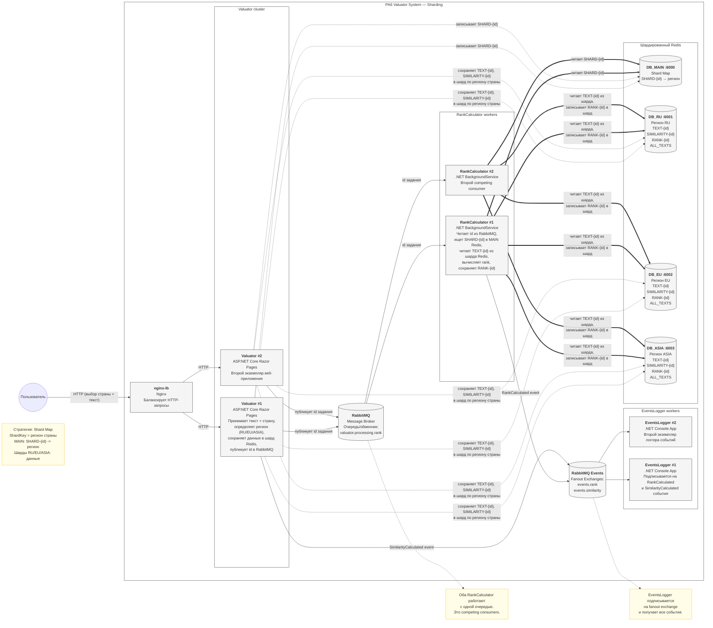

```mermaid
flowchart LR
  subgraph VC["Valuator cluster"]
      direction TB
          V2["<b>Valuator #2</b><br>ASP.NET Core Razor Pages<br>Второй экземпляр веб-приложения"]
          V1["<b>Valuator #1</b><br>ASP.NET Core Razor Pages<br>Принимает текст + страну,<br>определяет регион (RU/EU/ASIA),<br>сохраняет данные в шард Redis,<br>публикует id в RabbitMQ"]
  end
  subgraph RCW["RankCalculator workers"]
      direction TB
          RC2["<b>RankCalculator #2</b><br>.NET BackgroundService<br>Второй competing consumer"]
          RC1["<b>RankCalculator #1</b><br>.NET BackgroundService<br>Читает id из RabbitMQ,<br>ищет SHARD-{id} в MAIN Redis,<br>читает TEXT-{id} из шарда Redis,<br>вычисляет rank, сохраняет RANK-{id}"]
  end
  subgraph ELW["EventsLogger workers"]
      direction TB
          EL2["<b>EventsLogger #2</b><br>.NET Console App<br>Второй экземпляр логгера событий"]
          EL1["<b>EventsLogger #1</b><br>.NET Console App<br>Подписывается на RankCalculated<br>и SimilarityCalculated события"]
  end
  subgraph RedisShards["Шардированный Redis"]
      direction TB
          Main[("<b>DB_MAIN :6000</b><br>Shard Map<br>SHARD-{id} → регион")]
          RU[("<b>DB_RU :6001</b><br>Регион RU<br>TEXT-{id}<br>SIMILARITY-{id}<br>RANK-{id}<br>ALL_TEXTS")]
          EU[("<b>DB_EU :6002</b><br>Регион EU<br>TEXT-{id}<br>SIMILARITY-{id}<br>RANK-{id}<br>ALL_TEXTS")]
          Asia[("<b>DB_ASIA :6003</b><br>Регион ASIA<br>TEXT-{id}<br>SIMILARITY-{id}<br>RANK-{id}<br>ALL_TEXTS")]
  end
  subgraph System["PA6 Valuator System — Sharding"]
      direction LR
          Nginx["<b>nginx-lb</b><br>Nginx<br>Балансирует HTTP-запросы"]
          VC
          MQ[("<b>RabbitMQ</b><br>Message Broker<br>Очередь/обменник:<br>valuator.processing.rank")]
          RCW
          RedisShards
          EventsMQ[("<b>RabbitMQ Events</b><br>Fanout Exchanges:<br>events.rank<br>events.similarity")]
          ELW
  end
      User(("Пользователь")) -- HTTP (выбор страны + текст) --> Nginx
      Nginx -- HTTP --> V1 & V2
      V1 -- публикует id задания --> MQ
      V2 -- публикует id задания --> MQ
      MQ -- id задания --> RC1 & RC2

      V1 -. "записывает SHARD-{id}" .-> Main
      V2 -. "записывает SHARD-{id}" .-> Main
      RC1 == "читает SHARD-{id}" ===> Main
      RC2 == "читает SHARD-{id}" ===> Main

      V1 -. "сохраняет TEXT-{id}, SIMILARITY-{id}<br>в шард по региону страны" .-> RU
      V1 -. "сохраняет TEXT-{id}, SIMILARITY-{id}<br>в шард по региону страны" .-> EU
      V1 -. "сохраняет TEXT-{id}, SIMILARITY-{id}<br>в шард по региону страны" .-> Asia
      V2 -. "сохраняет TEXT-{id}, SIMILARITY-{id}<br>в шард по региону страны" .-> RU
      V2 -. "сохраняет TEXT-{id}, SIMILARITY-{id}<br>в шард по региону страны" .-> EU
      V2 -. "сохраняет TEXT-{id}, SIMILARITY-{id}<br>в шард по региону страны" .-> Asia

      RC1 == "читает TEXT-{id} из шарда,<br>записывает RANK-{id} в шард" ===> RU
      RC1 == "читает TEXT-{id} из шарда,<br>записывает RANK-{id} в шард" ===> EU
      RC1 == "читает TEXT-{id} из шарда,<br>записывает RANK-{id} в шард" ===> Asia
      RC2 == "читает TEXT-{id} из шарда,<br>записывает RANK-{id} в шард" ===> RU
      RC2 == "читает TEXT-{id} из шарда,<br>записывает RANK-{id} в шард" ===> EU
      RC2 == "читает TEXT-{id} из шарда,<br>записывает RANK-{id} в шард" ===> Asia

      RC1 -- "RankCalculated event" --> EventsMQ
      V1 -- "SimilarityCalculated event" --> EventsMQ
      EventsMQ --> EL1 & EL2
      MQ -.-> Note1["Оба RankCalculator работают<br>с одной очередью.<br>Это competing consumers."]
      EventsMQ -.-> Note2["EventsLogger подписывается<br>на fanout exchange<br>и получает все события."]
      Note3["Стратегия: Shard Map<br>ShardKey = регион страны<br>MAIN: SHARD-{id} -> регион<br>Шарды RU/EU/ASIA: данные"]

       Nginx:::nodeStyle
       V2:::nodeStyle
       V1:::nodeStyle
       MQ:::nodeStyle
       RC2:::nodeStyle
       RC1:::nodeStyle
       EU:::nodeStyle
       RU:::nodeStyle
       Asia:::nodeStyle
       Main:::nodeStyle
       EventsMQ:::nodeStyle
       EL1:::nodeStyle
       EL2:::nodeStyle
       Note1:::noteStyle
       Note2:::noteStyle
       Note3:::noteStyle
      classDef cluster fill:#fff,stroke:#333,stroke-width:1px
      classDef nodeStyle fill:#f5f5f5,stroke:#333,stroke-width:1px
      classDef noteStyle fill:#fffde7,stroke:#fbc02d,stroke-width:1px
```
