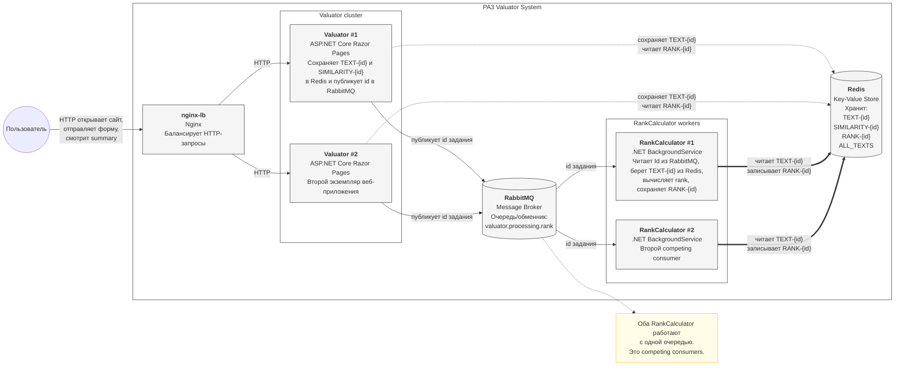

```mermaid
flowchart LR
 subgraph VC["Valuator cluster"]
    direction TB
        V2["<b>Valuator #2</b><br>ASP.NET Core Razor Pages<br>Второй экземпляр веб-приложения"]
        V1["<b>Valuator #1</b><br>ASP.NET Core Razor Pages<br>Сохраняет TEXT-{id} и SIMILARITY-{id}<br>в Redis и публикует id в RabbitMQ"]
  end
 subgraph RCW["RankCalculator workers"]
    direction TB
        RC2["<b>RankCalculator #2</b><br>.NET BackgroundService<br>Второй competing consumer"]
        RC1["<b>RankCalculator #1</b><br>.NET BackgroundService<br>Читает Id из RabbitMQ, берет TEXT-{id} из Redis,<br>вычисляет rank, сохраняет RANK-{id}"]
  end
 subgraph System["PA3 Valuator System"]
    direction LR
        Nginx["<b>nginx-lb</b><br>Nginx<br>Балансирует HTTP-запросы"]
        VC
        MQ[("<b>RabbitMQ</b><br>Message Broker<br>Очередь/обменник:<br>valuator.processing.rank")]
        RCW
        Redis[("<b>Redis</b><br>Key-Value Store<br>Хранит:<br>TEXT-{id}<br>SIMILARITY-{id}<br>RANK-{id}<br>ALL_TEXTS")]
  end
    User(("Пользователь")) -- HTTP открывает сайт,<br>отправляет форму,<br>смотрит summary --> Nginx
    Nginx -- HTTP --> V1 & V2
    V1 -- публикует id задания --> MQ
    V2 -- публикует id задания --> MQ 
    MQ -- id задания --> RC1 & RC2
    V1 -. "сохраняет TEXT-{id}<br>читает RANK-{id}" .-> Redis
    V2 -. "сохраняет TEXT-{id}<br>читает RANK-{id}" .-> Redis
    RC1 == "читает TEXT-{id}<br>записывает RANK-{id}" ===> Redis
    RC2 == "читает TEXT-{id}<br>записывает RANK-{id}" ===> Redis
    MQ -.-> Note["Оба RankCalculator работают<br>с одной очередью.<br>Это competing consumers."]

     Nginx:::nodeStyle
     V2:::nodeStyle
     V1:::nodeStyle
     MQ:::nodeStyle
     RC2:::nodeStyle
     RC1:::nodeStyle
     Redis:::nodeStyle
     Note:::noteStyle
    classDef cluster fill:#fff,stroke:#333,stroke-width:1px
    classDef nodeStyle fill:#f5f5f5,stroke:#333,stroke-width:1px
    classDef noteStyle fill:#fffde7,stroke:#fbc02d,stroke-width:1px
```
