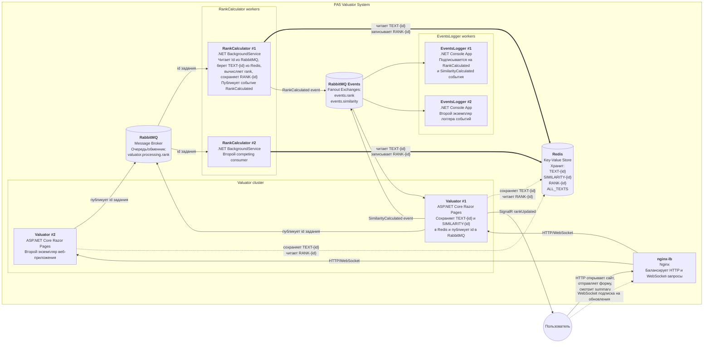
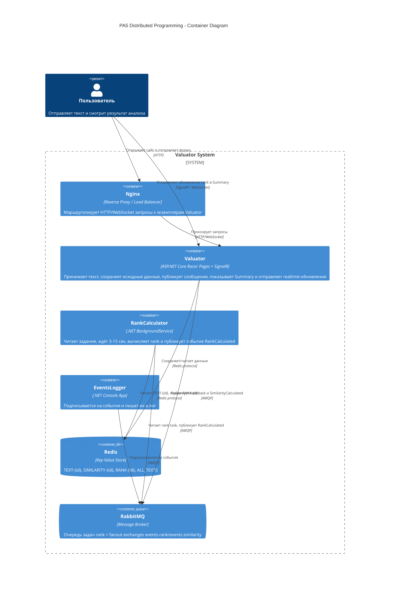

# Detailed Architecture (existing)

# C4 Container Diagram (LW5)

## Примечания

- `Valuator` и `RankCalculator` могут запускаться в нескольких экземплярах.
- Для `Summary` используется подписка клиента в SignalR-группу по `id`.
- `RankNotificationService` в `Valuator` получает `RankCalculated` из RabbitMQ и пушит `rankUpdated` в браузер.