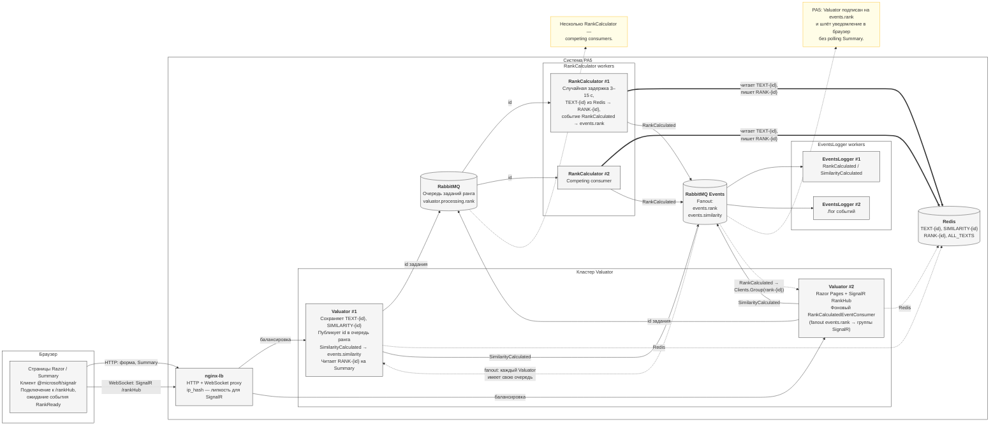

```mermaid
flowchart LR
  subgraph Browser["Браузер"]
      direction TB
      B["Страницы Razor / Summary<br>Клиент @microsoft/signalr<br>Подключение к /rankHub,<br>ожидание события RankReady"]
  end
  subgraph VC["Кластер Valuator"]
      direction TB
      V2["<b>Valuator #2</b><br>Razor Pages + SignalR RankHub<br>Фоновый RankCalculatedEventConsumer<br>(fanout events.rank → группы SignalR)"]
      V1["<b>Valuator #1</b><br>Сохраняет TEXT-{id}, SIMILARITY-{id}<br>Публикует id в очередь ранга<br>SimilarityCalculated → events.similarity<br>Читает RANK-{id} на Summary"]
  end
  subgraph RCW["RankCalculator workers"]
      direction TB
      RC2["<b>RankCalculator #2</b><br>Competing consumer"]
      RC1["<b>RankCalculator #1</b><br>Случайная задержка 3–15 с,<br>TEXT-{id} из Redis → RANK-{id},<br>событие RankCalculated → events.rank"]
  end
  subgraph ELW["EventsLogger workers"]
      direction TB
          EL2["<b>EventsLogger #2</b><br>Лог событий"]
          EL1["<b>EventsLogger #1</b><br>RankCalculated / SimilarityCalculated"]
  end
  subgraph System["Система PA5"]
      direction LR
          Nginx["<b>nginx-lb</b><br>HTTP + WebSocket proxy<br>ip_hash — липкость для SignalR"]
          VC
          MQ[("<b>RabbitMQ</b><br>Очередь заданий ранга<br>valuator.processing.rank")]
          RCW
          Redis[("<b>Redis</b><br>TEXT-{id}, SIMILARITY-{id}<br>RANK-{id}, ALL_TEXTS")]
          EventsMQ[("<b>RabbitMQ Events</b><br>Fanout:<br>events.rank<br>events.similarity")]
          ELW
  end
      B -- "HTTP: форма, Summary" --> Nginx
      B -- "WebSocket: SignalR /rankHub" --> Nginx
      Nginx -- балансировка --> V1 & V2
      V1 -- id задания --> MQ
      V2 -- id задания --> MQ
      MQ -- id --> RC1 & RC2
      V1 -. Redis .-> Redis
      V2 -. Redis .-> Redis
      RC1 == "читает TEXT-{id},<br>пишет RANK-{id}" ===> Redis
      RC2 == "читает TEXT-{id},<br>пишет RANK-{id}" ===> Redis
      RC1 -- RankCalculated --> EventsMQ
      RC2 -- RankCalculated --> EventsMQ
      V1 -- SimilarityCalculated --> EventsMQ
      V2 -- SimilarityCalculated --> EventsMQ
      EventsMQ --> EL1 & EL2
      EventsMQ -.->|"fanout: каждый Valuator<br>имеет свою очередь"| V1
      EventsMQ -.->|"RankCalculated →<br>Clients.Group(rank-{id})"| V2
      MQ -.-> NoteRC["Несколько RankCalculator —<br>competing consumers."]
      EventsMQ -.-> NoteSig["PA5: Valuator подписан на events.rank<br>и шлёт уведомление в браузер<br>без polling Summary."]
       Nginx:::nodeStyle
       B:::nodeStyle
       V2:::nodeStyle
       V1:::nodeStyle
       MQ:::nodeStyle
       RC2:::nodeStyle
       RC1:::nodeStyle
       Redis:::nodeStyle
       EventsMQ:::nodeStyle
       EL1:::nodeStyle
       EL2:::nodeStyle
       NoteRC:::noteStyle
       NoteSig:::noteStyle
      classDef cluster fill:#fff,stroke:#333,stroke-width:1px
      classDef nodeStyle fill:#f5f5f5,stroke:#333,stroke-width:1px
      classDef noteStyle fill:#fffde7,stroke:#fbc02d,stroke-width:1px
```